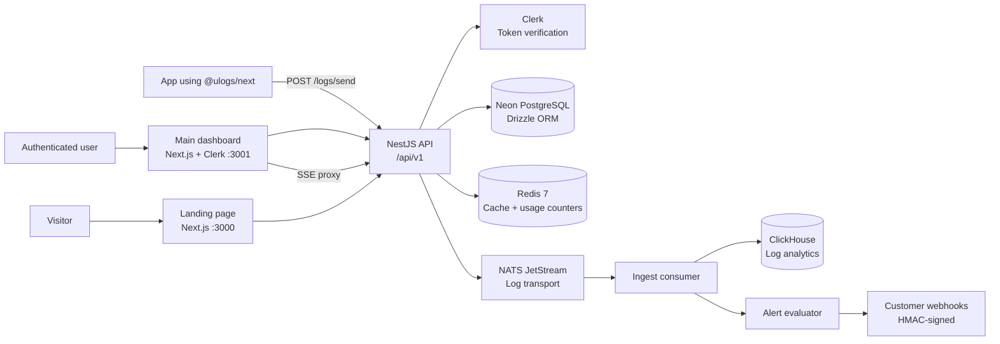

# ULogs

> A developer-focused observability platform for collecting, exploring, alerting on, and integrating application logs.

[](#project-status)
[](https://www.typescriptlang.org/)
[](https://nestjs.com/)
[](https://nextjs.org/)
[](https://redis.io/)

ULogs is an active monorepo for a log-collection and observability product. The repository currently contains:

- a public marketing site for the product,
- an authenticated dashboard for logs, alerts, queries, API keys, and billing,
- a NestJS backend for auth, log ingestion, alerting, usage quotas, billing, and persistence,
- a typed Next.js SDK for structured log delivery and live log reads,
- local infrastructure for Redis, ClickHouse, NATS JetStream, and database access during development.

This project is still moving toward its first production-ready release, so APIs, infrastructure wiring, and deployment details are expected to evolve while the platform is hardened.

## Contents

- [Project status](#project-status)
- [Architecture](#architecture)
- [Repository layout](#repository-layout)
- [Prerequisites](#prerequisites)
- [Configuration](#configuration)
- [Getting started](#getting-started)
- [Available commands](#available-commands)
- [SDK](#sdk)
- [Backend API](#backend-api)
- [Alerts](#alerts)
- [Billing and invoices](#billing-and-invoices)
- [Testing](#testing)
- [Production considerations](#production-considerations)
- [Security](#security)
- [Contributing](#contributing)
- [License](#license)

## Project status

### Implemented

- Public marketing and landing-page experience (Clerk sign-in/sign-up, pricing, waitlist).
- Authenticated dashboard: overview metrics, live log tail (SSE with polling fallback), query console, alert management, API-key management, integrations, settings/billing.
- API-key creation, listing, inspection (last-used), revocation, and regeneration endpoints.
- Clerk bearer-token and API-key (`x-api-key`, Argon2-hashed) authentication paths.
- Usage/quota enforcement per plan tier backed by Redis counters with a periodic database sync.
- PostgreSQL persistence through Neon and Drizzle ORM.
- Redis-backed API-key caching, alert caches, and usage counters.
- Local ClickHouse, ClickHouse UI, and NATS infrastructure through Docker Compose.
- NATS JetStream ingestion pipeline: `POST /logs/send` → stream → consumer → ClickHouse insert → alert evaluation.
- Alert engine: thresholded conditions per rule, Redis bucket counters, cooldown handling, HMAC-signed outbound webhook delivery with SSRF guarding.
- SSE live-log streaming and a live ingest-metrics stream (rate, backlog, latency).
- Stripe Checkout, Billing Portal, subscription webhooks (including cancellation downgrade), and persisted invoices.
- `@ulogs/next` SDK with typed log payloads, buffered delivery, graceful-shutdown flush, authenticated reads (`get`/`stream`), inbound webhook verification, and React data hooks.

### In progress

- Final production hardening, retention policy, and ClickHouse query optimization for log analytics.
- Production deployment and operational observability.
- Automated CI quality gates and release workflows.
- Final SDK publishing workflow and broader integration coverage.

## Architecture



The repository contains three independently runnable applications plus an SDK package:

- **Landing page:** public product and integration experience.
- **Main dashboard:** authenticated product interface.
- **Services:** NestJS API, ingestion pipeline, alerting, billing, and persistence boundary.
- **SDK:** `@ulogs/next`, a typed Node/Next.js logging client.

## Repository layout

```text
.
├── apps/
│   ├── landing-page/       # Public Next.js marketing site
│   └── main-dashboard/     # Authenticated Next.js dashboard and user workspace
├── services/               # NestJS API, database layer, NATS pipeline, Stripe hooks, local infra
│   ├── src/
│   │   ├── modules/        # alert, api-key, billing, logs
│   │   ├── nats/           # JetStream publish/consume, ingest + alert consumers
│   │   ├── clickhouse/     # log analytics client
│   │   ├── database/       # Drizzle/Neon client and schema
│   │   ├── guards/         # AuthGuard, UsageGuard
│   │   ├── schedulers/     # usage DB-sync cron
│   │   └── sse/            # SSE client registry
│   ├── test/
│   ├── drizzle/            # Generated database migrations
│   ├── docker-compose.yml  # Local Redis, ClickHouse, UI, and NATS services
│   ├── README.md
│   └── package.json
├── sdks/
│   └── ulogs-next/         # Typed SDK package; source code + distributable build output
├── testsprite_tests/       # Generated API test plans, cases, and reports
├── README.md
├── AGENTS.md
├── CLAUDE.md
├── .vscode/                # Local editor and MCP configuration
└── .gitignore
```

Each app and service has its own `package.json`, lockfile, TypeScript configuration, and dependency installation. There is no root-level workspace package manager yet, so install and run commands are executed from each package directory unless the app intentionally exposes a shared script.

> **Note:** both Next.js apps in this repo run a modified Next.js release. The middleware file is named `proxy.ts` (not `middleware.ts`), and app-specific docs live in each project's `AGENTS.md` and `node_modules/next/dist/docs/`.

## Prerequisites

- Node.js 20 or newer (Node.js 24 is used in the current development environment).
- npm 10 or newer.
- Docker Desktop, for local Redis, ClickHouse, ClickHouse UI, and NATS.
- A Neon PostgreSQL database and connection string.
- A Clerk application with a secret key for authenticated API requests.
- A Stripe account with recurring subscription prices for billing flows.
- A TestSprite account and API key only when running TestSprite MCP tests.

## Configuration

Do not commit secrets. The existing `.env` files are intentionally ignored by Git. Create the following files locally.

### Backend: `services/.env`

```dotenv
PORT=8080
DATABASE_URL=postgresql://<user>:<password>@<host>/<database>?sslmode=require
REDIS_HOST=localhost
REDIS_PORT=6379
REDIS_PASSWORD=***
REDIS_DB=0
REDIS_KEY_SECRET=<random-secret>
CLERK_SECRET_KEY=<clerk-secret-key>
CLICKHOUSE_URL=http://localhost:8123
CLICKHOUSE_USER=default
CLICKHOUSE_PASSWORD=
CLICKH…ogs
NATS_URL=nats://localhost:4222
STRIPE_SECRET_KEY=<stripe-secret-key>
STRIPE_WEBHOOK_SECRET=<stripe-webhook-signing-secret>
STRIPE_STARTER_PRICE_ID=<stripe-starter-price-id>
STRIPE_PRO_PRICE_ID=<stripe-pro-price-id>
STRIPE_BUSINESS_PRICE_ID=<stripe-business-price-id>
WEBHOOK_SIGNING_SECRET=<rando…pts>
APP_URL=http://localhost:3000
```

- `REDIS_KEY_SECRET` is used to derive API-key cache digests and should be a long, random value.
- `WEBHOOK_SIGNING_SECRET` signs outbound alert webhooks so receivers (and the SDK's `verifyWebhook`) can authenticate them.
- The Stripe price IDs must refer to recurring subscription prices in the same Stripe account as `STRIPE_SECRET_KEY`. `APP_URL` is used for Stripe Checkout and Billing Portal return URLs.
- Use a secret manager for shared or production environments.

### Main dashboard: `apps/main-dashboard/.env`

```dotenv
NEXT_PUBLIC_CLERK_PUBLISHABLE_KEY=<clerk-publishable-key>
NEXT_PUBLIC_SERVER_URI=http://localhost:8080/api/v1
NEXT_PUBLIC_MARKETING_URL=http://localhost:3000
ULOGS_API_KEY=<one-of-your-ULOG-keys>
```

The dashboard obtains a Clerk session token in the browser and forwards it to the backend through its server-side API proxy routes. `NEXT_PUBLIC_MARKETING_URL` is where unauthenticated visitors are redirected by `proxy.ts`.

### Landing page: `apps/landing-page/.env`

```dotenv
NEXT_PUBLIC_CLERK_PUBLISHABLE_KEY=<clerk-publishable-key>
NEXT_PUBLIC_DASHBOARD_URL=http://localhost:3001
```

`NEXT_PUBLIC_DASHBOARD_URL` is the target of all "Get Started / Dashboard / Billing" links on the marketing site.

### SDK: `sdks/ulogs-next`

The SDK uses the local API by default. Override the endpoint for staging or production with:

```dotenv
ULOGS_BASE_URL=https://api.example.com/api/v1
```

The transport reads `ULOGS_BASE_URL` at runtime and falls back to `http://localhost:8080/api/v1`.

## Getting started

### 1. Install dependencies

Open separate terminals, or run each command from its package directory:

```powershell
cd services
npm install

cd ..\apps\main-dashboard
npm install

cd ..\landing-page
npm install

cd ..\..\sdks\ulogs-next
npm install && npm run build
```

The dashboard consumes the SDK as a local `file:` dependency, so rebuild the SDK (`npm run build` in `sdks/ulogs-next`) after every SDK source change.

### 2. Configure the backend

Create `services/.env` using the template above and provide a valid Neon `DATABASE_URL` and Clerk secret. Ensure the database schema is migrated (`npm run db:migrate` or `db:push`) before starting authenticated API flows.

### 3. Start local infrastructure

From the `services` directory:

```powershell
docker compose up -d
```

This starts:

- Redis on `localhost:6379`
- ClickHouse HTTP on `localhost:8123` and native protocol on `localhost:9000`
- ClickHouse UI on `localhost:5521`
- NATS client connections on `localhost:4222` and monitoring on `localhost:8222`

Use `docker compose ps` to inspect container status and `docker compose down` to stop the stack.

### 4. Start the backend

```powershell
cd services
npm run start:dev
```

The API listens on `http://localhost:8080` and uses the versioned base path `http://localhost:8080/api/v1`.

### 5. Start the landing page

```powershell
cd apps\landing-page
npm run dev
```

Open `http://localhost:3000`.

### 6. Start the dashboard

Use a separate terminal and a different port (both apps default to `next dev` on 3000):

```powershell
cd apps\main-dashboard
npx next dev -p 3001
```

Open `http://localhost:3001`. The landing page links to it through `NEXT_PUBLIC_DASHBOARD_URL`, and the dashboard redirects unauthenticated visitors back to `NEXT_PUBLIC_MARKETING_URL`.

## Available commands

### Backend (`services`)

| Command               | Purpose                                    |
| --------------------- | ------------------------------------------ |
| `npm run start:dev`   | Start NestJS in watch mode                 |
| `npm run build`       | Compile the service                        |
| `npm run test`        | Run unit tests                             |
| `npm run test:e2e`    | Run end-to-end tests                       |
| `npm run test:cov`    | Generate test coverage                     |
| `npm run db:generate` | Generate Drizzle migrations                |
| `npm run db:migrate`  | Apply Drizzle migrations                   |
| `npm run db:push`     | Push the schema to the configured database |

> **Current production-start note:** the current Nest build emits `dist/src/main.js`, while `npm run start:prod` currently targets `dist/main`. Until that script is aligned, use `npm run build` followed by `node dist/src/main.js` from `services`.

### Frontends (`apps/main-dashboard` and `apps/landing-page`)

| Command         | Purpose                              |
| --------------- | ------------------------------------ |
| `npm run dev`   | Start the Next.js development server |
| `npm run build` | Create a production build            |
| `npm run start` | Serve a completed production build   |
| `npm run lint`  | Run ESLint                           |

### SDK (`sdks/ulogs-next`)

| Command              | Purpose                                                  |
| -------------------- | -------------------------------------------------------- |
| `npm install`        | Install SDK development dependencies                     |
| `npm run build`      | Compile JavaScript and declaration files                 |
| `npm run clean`      | Remove `dist/` using the cross-platform `rimraf` tool    |
| `npm pack --dry-run` | Preview the publishable package contents                 |
| `npm publish`        | Rebuild through `prepublishOnly` and publish the package |

The SDK keeps its TypeScript implementation under `src/` locally. The repository configuration is intentionally set up to ignore `src/` and publish/track compiled `dist/` artifacts instead.

## SDK

The current package is `@ulogs/next`. It exposes `createLogger`, `ULOGSTransport`, the React data hooks (`getLogs`, `getStream`), and the public log types. See [`sdks/ulogs-next/README.md`](sdks/ulogs-next/README.md) for the full reference.

```typescript
import { createLogger } from "@ulogs/next";

const logger = createLogger({
  apiKey: process.env.ONE_MINUTE_LOGS_API_KEY!,
  appName: "orders-service",
  environment: "production",
});

await logger.info({
  message: "Order created",
  service: "checkout",
  importance: "low",
});
```

Writes are buffered and flushed in batches (2-second interval, plus a graceful-shutdown flush of every active transport) to `POST /logs/send`. Reads (`logger.get`, `logger.stream`) authenticate with the API key by default, or with a Clerk bearer token via the optional `authToken` request option. Publish the SDK only from the private source workspace because the GitHub-facing package layout intentionally excludes `src/`.

## Backend API

The backend uses a global `/api` prefix and URI versioning. The current API base URL is:

```text
http://localhost:8080/api/v1
```

All routes require authentication through either a valid Clerk bearer token or a valid `x-api-key` header, except `POST /billing/webhook` (Stripe signature auth). Alert and ingestion routes additionally pass through `UsageGuard`, which enforces plan-tier quotas.

| Method   | Endpoint                          | Description                                              |
| -------- | --------------------------------- | -------------------------------------------------------- |
| `GET`    | `/api/v1/api-keys`                | List API keys belonging to the authenticated user        |
| `POST`   | `/api/v1/api-keys`                | Create an API key; the plaintext secret is returned once |
| `GET`    | `/api/v1/api-keys/:id`            | Retrieve last-used metadata for a key                    |
| `DELETE` | `/api/v1/api-keys/:id`            | Revoke an owned key                                      |
| `POST`   | `/api/v1/api-keys/:id/regenerate` | Generate a replacement secret for an owned key           |
| `POST`   | `/api/v1/logs/send`               | Receive a batched payload of logs (published to NATS)    |
| `GET`    | `/api/v1/logs`                    | Query historical logs (`type`, `appName`, `env`, `search`, `from`, `to`, `limit`) |
| `GET`    | `/api/v1/logs/stream`             | SSE stream: initial backlog then live delivery           |
| `GET`    | `/api/v1/logs/get-dashboard-logs` | Aggregated dashboard stats for a time range              |
| `GET`    | `/api/v1/logs/metrics/stream`     | SSE stream of ingest rate, backlog, and latency metrics  |
| `GET`    | `/api/v1/alerts`                  | List alert rules for the authenticated user              |
| `POST`   | `/api/v1/alerts`                  | Create an alert rule (name, conditions, threshold, webhook URL, cooldown) |
| `POST`   | `/api/v1/alerts/verify-webhook`   | Verify an inbound HMAC-signed alert webhook (API-key auth) |

API keys are stored as Argon2 hashes. The plaintext secret is not returned by listing endpoints and should be copied securely immediately after creation.

## Alerts

Alert rules evaluate ingested logs against conditions (field/operator/value on `type`, `importance`, `environment`, and message search) with a `{ count, windowMinutes }` threshold and a per-rule cooldown. Matching is done by the NATS alert consumer using Redis bucket counters; when a rule fires, a HMAC-signed webhook is delivered to the configured URL (retries are governed by the cooldown). Outbound webhook URLs are validated against localhost, private, and link-local ranges (SSRF guard) before any request is made. The dashboard's Alerts page creates rules and verifies the webhook destination client-side before saving.

## Billing and invoices

The dashboard uses Stripe Checkout for paid plans and the Stripe Billing Portal for subscription management. Billing endpoints require a valid Clerk bearer token unless noted otherwise:

| Method | Endpoint                   | Description                                                                                                      |
| ------ | -------------------------- | ---------------------------------------------------------------------------------------------------------------- |
| `GET`  | `/api/v1/billing/current`  | Return the authenticated user's current plan                                                                     |
| `GET`  | `/api/v1/billing/invoices` | List invoices saved for the authenticated user                                                                   |
| `POST` | `/api/v1/billing`          | Create a Stripe Checkout session; send `{ "plan": "starter" }`, `{ "plan": "pro" }`, or `{ "plan": "business" }` |
| `POST` | `/api/v1/billing/portal`   | Create a Stripe Billing Portal session for a paid user                                                           |
| `POST` | `/api/v1/billing/webhook`  | Receive and verify Stripe webhook events                                                                         |

Invoice records are persisted in the `payment_invoices` table when Stripe sends invoice events. The service resolves the invoice owner from Stripe metadata, the stored subscription ID, or the stored Stripe customer ID, then upserts the invoice by its Stripe invoice ID. This makes webhook retries safe and allows the dashboard's invoice table to display payment status, amounts, dates, and downloadable Stripe URLs.

### Webhook request flow

The current implementation handles a Stripe webhook as follows:

1. `services/src/main.ts` creates the Nest application with `rawBody: true`, so the original request bytes remain available for Stripe signature verification. It also registers JSON and URL-encoded body parsers with a 3 MB limit.
2. `BillingController` exposes `POST /api/v1/billing/webhook`, reads the `stripe-signature` header, and passes both the signature and `req.rawBody` to `BillingService`.
3. `BillingService` reads `STRIPE_WEBHOOK_SECRET` and calls Stripe's `constructEvent`. Missing or invalid signatures are rejected before event processing.
4. The service dispatches supported event types:

- `checkout.session.completed` activates the selected paid plan and raises the usage quota.
- `customer.subscription.created` and `customer.subscription.updated` synchronize the paid plan.
- `customer.subscription.deleted` downgrades the user to the free plan and resets quota sources.
- `invoice.created`, `invoice.finalized`, `invoice.payment_failed`, and `invoice.voided` save invoice state.
- `invoice.paid` and `invoice.payment_succeeded` save invoice state and synchronize the paid plan from invoice metadata or its price ID.

5. `saveInvoice()` extracts Stripe customer/subscription IDs, resolves the application user, converts Unix timestamps to dates, and upserts the record in `payment_invoices` using `stripe_invoice_id` as the conflict key.
6. The webhook responds with `{ "recieved": true }` after the selected handler completes. (The response key is currently spelled `recieved` in the implementation.)

Usage counters live in Redis (`ulogs:usage:v1:{userId}`, with a 6-minute TTL) and are synced back to the database by a scheduled job (`services/src/schedulers/usage-db-sync.ts`).

Invoice ownership is intentionally scoped to the authenticated application user. If an invoice has no matching `userId` metadata and no matching `plan` row for its subscription or customer, `saveInvoice()` skips it and the webhook still returns successfully. Check the Stripe event payload, the `plan` table, and the service's `DATABASE_URL` when an invoice appears in Stripe but not in the dashboard database. The API does not import historical invoices directly from Stripe; resend the event after the webhook and ownership configuration is correct.

The webhook endpoint is not protected by the Clerk `AuthGuard`; Stripe authenticates it with the `stripe-signature` header and `STRIPE_WEBHOOK_SECRET`. Do not call it with a normal browser request or alter the request body before signature verification.

### Local Stripe webhook testing

1. Start the backend and ensure `services/.env` contains the Stripe variables above.
2. Start the Stripe CLI listener from the `services` directory:

```powershell
stripe listen --forward-to localhost:8080/api/v1/billing/webhook
```

3. Copy the `whsec_...` value printed by the CLI into `STRIPE_WEBHOOK_SECRET` and restart the backend.
4. Complete a test Checkout payment or resend an existing invoice event from the Stripe Dashboard.
5. Refresh the dashboard Settings page. The invoice appears after the webhook has been accepted and persisted.

If an invoice was created before invoice persistence was enabled, resend its Stripe webhook event from **Stripe Dashboard → Developers → Webhooks**. Existing Stripe invoices are not imported automatically by the `/billing/invoices` endpoint.

## Testing

Run backend tests from `services`:

```powershell
npm run test
npm run test:e2e
```

Run frontend static checks from the relevant app:

```powershell
cd apps\main-dashboard
npm run lint
npm run build
```

TestSprite backend artifacts are stored under `testsprite_tests/`. The latest API-key report is available at [`testsprite_tests/testsprite-mcp-test-report.md`](testsprite_tests/testsprite-mcp-test-report.md).

For TestSprite MCP, keep the API key outside source control. The workspace MCP configuration uses a masked VS Code input rather than embedding the credential in `.vscode/mcp.json`.

## Production considerations

Before calling this project production-ready:

- Move all secrets to a managed secret store such as Azure Key Vault, AWS Secrets Manager, or an equivalent platform service.
- Replace local Redis credentials and configure TLS, network restrictions, persistence, monitoring, and backups as appropriate.
- Add a public health/readiness endpoint for load balancers and tunnel-based testing.
- Align the production start script with the actual Nest build output.
- Define ClickHouse retention, TTL, and partitioning policies for long-lived log data.
- Add structured logging, tracing, metrics, alerting, and error tracking for the platform itself.
- Secure ClickHouse and NATS credentials/configuration; the local Compose file currently uses development defaults.
- Add rate limiting and abuse protection to authentication and API-key endpoints.
- Complete the SDK retry/error semantics and provide a documented ingestion contract before publishing it for production use.
- Add CI checks for formatting, linting, type checking, migrations, unit tests, e2e tests, and dependency vulnerabilities.
- Review CORS, Clerk token validation, ownership checks, and cache invalidation before deployment.
- Use separate credentials and databases for development, staging, and production.

## Security

- Never commit `.env` files, API keys, database URLs, Clerk secrets, or MCP credentials.
- Rotate any credential that has been exposed in logs, chat, screenshots, commits, or configuration files.
- Treat API-key plaintext values as one-time secrets.
- Keep server-only credentials out of `NEXT_PUBLIC_*` variables and browser bundles.
- Do not expose `x-api-key` values in client-side applications; the SDK is intended for server-side usage.
- Alert webhook URLs are validated against private and loopback address ranges (SSRF guard); keep outbound traffic on `http`/`https` only.
- Prefer short-lived credentials and least-privilege database roles.
- Report security issues privately to the project maintainers rather than opening a public issue with exploit details.

## Contributing

1. Create a focused branch from the current development branch.
2. Keep changes scoped and update documentation for user-facing behavior.
3. Add or update tests for backend behavior and API contracts.
4. Run the relevant lint, type-check, build, and test commands locally.
5. Open a pull request with a concise summary, validation evidence, configuration changes, and known limitations.

## License

The repository does not currently declare a finalized open-source license. Treat the project as proprietary unless the maintainers publish explicit licensing terms.

## Related documentation

- [`services/README.md`](services/README.md) — NestJS service notes
- [`apps/main-dashboard/README.md`](apps/main-dashboard/README.md) — dashboard notes
- [`apps/landing-page/README.md`](apps/landing-page/README.md) — landing-page notes
- [`sdks/ulogs-next/README.md`](sdks/ulogs-next/README.md) — SDK reference
