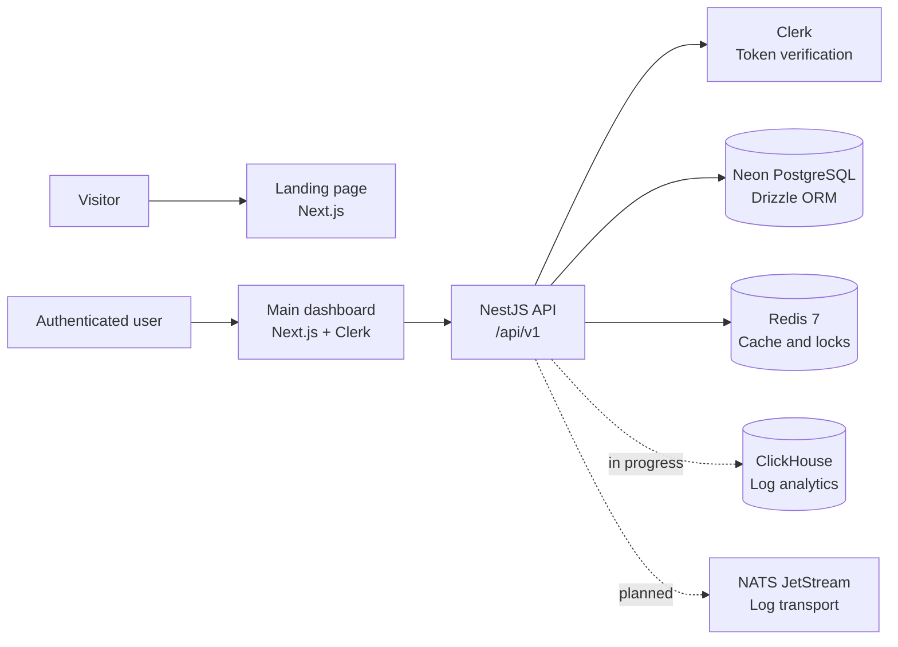

# ULogs

> A developer-focused observability platform for collecting, exploring, and integrating application logs.

[](#project-status)
[](https://www.typescriptlang.org/)
[](https://nestjs.com/)
[](https://nextjs.org/)
[](https://redis.io/)

ULogs is currently under active development. This repository contains the landing page, authenticated dashboard, and backend service that power the platform. APIs and infrastructure may change while the product moves toward its first production release.

## Contents

- [Project status](#project-status)
- [Architecture](#architecture)
- [Repository layout](#repository-layout)
- [Prerequisites](#prerequisites)
- [Configuration](#configuration)
- [Getting started](#getting-started)
- [Available commands](#available-commands)
- [SDK](#sdk)
- [Backend API](#backend-api)
- [Testing](#testing)
- [Production considerations](#production-considerations)
- [Security](#security)
- [Contributing](#contributing)
- [License](#license)

## Project status

### Implemented

- Public marketing and landing-page experience.
- Authenticated dashboard shell with Clerk integration.
- API-key creation, listing, inspection, revocation, and regeneration endpoints.
- Clerk bearer-token and API-key authentication paths.
- PostgreSQL persistence through Neon and Drizzle ORM.
- Redis-backed API-key caching and last-used tracking.
- Local ClickHouse, ClickHouse UI, and NATS infrastructure through Docker Compose.
- Initial `@ulogs/next` SDK package with typed log payloads, buffered delivery, and API-key authentication headers.
- TestSprite coverage for the API-key service, including authenticated flows where test credentials are available and unauthenticated contract checks.

### In progress

- Log ingestion and ClickHouse persistence. The ClickHouse schema and container are present, but the client wiring and `/logs/send` API are not complete.
- Production deployment and operational observability.
- Automated CI quality gates and release workflows.
- Final API contracts, SDK publishing workflow, and broader integration coverage.

## Architecture



The repository contains three independently runnable applications plus an SDK package:

- **Landing page:** public product and integration experience.
- **Main dashboard:** authenticated product interface.
- **Services:** NestJS API and persistence/authentication boundary.
- **SDK:** `@ulogs/next`, a typed Node/Next.js logging client under active development.

## Repository layout

```text
.
├── apps/
│   ├── landing-page/       # Public Next.js marketing site
│   └── main-dashboard/     # Authenticated Next.js dashboard
├── services/                # NestJS API, database, Redis integration, tests
│   ├── src/
│   ├── test/
│   ├── drizzle/             # Generated database migrations
│   └── docker-compose.yml   # Local Redis, ClickHouse, UI, and NATS services
├── sdks/
│   └── ulogs-next/           # Typed SDK package; private src, distributable dist
├── testsprite_tests/        # Generated API test plans, cases, and reports
└── .vscode/                 # Local editor/MCP configuration
```

Each application has its own `package.json`, lockfile, TypeScript configuration, and dependency installation. There is no root-level package manager workspace yet.

## Prerequisites

- Node.js 20 or newer (Node.js 24 is used in the current development environment).
- npm 10 or newer.
- Docker Desktop, for local Redis, ClickHouse, ClickHouse UI, and NATS.
- A Neon PostgreSQL database and connection string.
- A Clerk application with a secret key for authenticated API requests.
- A TestSprite account and API key only when running TestSprite MCP tests.

## Configuration

Do not commit secrets. The existing `.env` files are intentionally ignored by Git. Create the following files locally.

### Backend: `services/.env`

```dotenv
PORT=8080
DATABASE_URL=postgresql://<user>:<password>@<host>/<database>?sslmode=require
REDIS_HOST=localhost
REDIS_PORT=6379
REDIS_PASSWORD=ulogs
REDIS_DB=0
REDIS_KEY_SECRET=<random-secret>
CLERK_SECRET_KEY=<clerk-secret-key>
```

`REDIS_KEY_SECRET` is used to derive API-key cache digests and should be a long, random value. Use a secret manager for shared or production environments.

### Main dashboard: `apps/main-dashboard/.env`

```dotenv
NEXT_PUBLIC_CLERK_PUBLISHABLE_KEY=<clerk-publishable-key>
NEXT_PUBLIC_SERVER_URI=http://localhost:8080/api/v1
```

The dashboard obtains a Clerk session token in the browser and sends it to the backend as a bearer token.

### SDK: `sdks/ulogs-next`

The SDK uses the local API by default. Override the endpoint for staging or production with:

```dotenv
ULOGS_BASE_URL=https://api.example.com/api/v1
```

The current transport reads `ULOGS_BASE_URL` at runtime and falls back to `http://localhost:8080/api/v1`.

### Landing page

Review the landing-page authentication and configuration code before deployment. Do not copy production credentials into source control or frontend bundles unless the variable is explicitly intended to be public.

## Getting started

### 1. Install dependencies

Open separate terminals, or run each command from its package directory:

```powershell
cd services
npm install

cd ..\apps\main-dashboard
npm install

cd ..\landing-page
npm install

cd ..\..\sdks\ulogs-next
npm install
```

### 2. Configure the backend

Create `services/.env` using the template above and provide a valid Neon `DATABASE_URL` and Clerk secret. Ensure the database schema is available before starting authenticated API flows.

### 3. Start local infrastructure

From the `services` directory:

```powershell
docker compose up -d
```

This starts:

- Redis on `localhost:6379`
- ClickHouse HTTP on `localhost:8123` and native protocol on `localhost:9000`
- ClickHouse UI on `localhost:5521`
- NATS client connections on `localhost:4222` and monitoring on `localhost:8222`

Use `docker compose ps` to inspect container status and `docker compose down` to stop the stack.

### 4. Start the backend

```powershell
cd services
npm run start:dev
```

The API listens on `http://localhost:8080` and uses the versioned base path `http://localhost:8080/api/v1`.

### 5. Start the dashboard

```powershell
cd apps\main-dashboard
npm run dev
```

Open `http://localhost:3000`.

### 6. Start the landing page

Use a separate terminal:

```powershell
cd apps\landing-page
npm run dev
```

If port `3000` is already in use by the dashboard, start the landing page on another Next.js development port.

## Available commands

### Backend (`services`)

| Command               | Purpose                                    |
| --------------------- | ------------------------------------------ |
| `npm run start:dev`   | Start NestJS in watch mode                 |
| `npm run build`       | Compile the service                        |
| `npm run test`        | Run unit tests                             |
| `npm run test:e2e`    | Run end-to-end tests                       |
| `npm run test:cov`    | Generate test coverage                     |
| `npm run db:generate` | Generate Drizzle migrations                |
| `npm run db:migrate`  | Apply Drizzle migrations                   |
| `npm run db:push`     | Push the schema to the configured database |

> **Current production-start note:** the current Nest build emits `dist/src/main.js`, while `npm run start:prod` currently targets `dist/main`. Until that script is aligned, use `npm run build` followed by `node dist/src/main.js` from `services`.

### Frontends (`apps/main-dashboard` and `apps/landing-page`)

| Command         | Purpose                              |
| --------------- | ------------------------------------ |
| `npm run dev`   | Start the Next.js development server |
| `npm run build` | Create a production build            |
| `npm run start` | Serve a completed production build   |
| `npm run lint`  | Run ESLint                           |

### SDK (`sdks/ulogs-next`)

| Command              | Purpose                                                  |
| -------------------- | -------------------------------------------------------- |
| `npm install`        | Install SDK development dependencies                     |
| `npm run build`      | Compile JavaScript and declaration files                 |
| `npm run clean`      | Remove `dist/` using the cross-platform `rimraf` tool    |
| `npm pack --dry-run` | Preview the publishable package contents                 |
| `npm publish`        | Rebuild through `prepublishOnly` and publish the package |

The SDK keeps its TypeScript implementation under `src/` locally. The repository configuration is intentionally set up to ignore `src/` and publish/track compiled `dist/` artifacts instead.

## SDK

The current package is `@ulogs/next`. It exposes `createLogger`, `ULOGSTransport`, and the public log types.

```typescript
import { createLogger } from "@ulogs/next";

const logger = createLogger({
  apiKey: process.env.ONE_MINUTE_LOGS_API_KEY!,
  appName: "orders-service",
  environment: "production",
});

await logger.info({
  message: "Order created",
  service: "checkout",
  importance: "low",
});
```

The transport buffers logs and sends batches to `POST /logs/send` below the configured API base URL. That ingestion route is not implemented in the current NestJS service yet, so SDK delivery is currently an integration-in-progress rather than a production-ready path. Publish the SDK only from the private source workspace because the GitHub-facing package layout intentionally excludes `src/`.

## Backend API

The backend uses a global `/api` prefix and URI versioning. The current API base URL is:

```text
http://localhost:8080/api/v1
```

All API-key routes require authentication through either a valid Clerk bearer token or a valid `x-api-key` header.

| Method   | Endpoint                          | Description                                              |
| -------- | --------------------------------- | -------------------------------------------------------- |
| `GET`    | `/api/v1/api-keys`                | List API keys belonging to the authenticated user        |
| `POST`   | `/api/v1/api-keys`                | Create an API key; the plaintext secret is returned once |
| `GET`    | `/api/v1/api-keys/:id`            | Retrieve last-used metadata for a key                    |
| `DELETE` | `/api/v1/api-keys/:id`            | Revoke an owned key                                      |
| `POST`   | `/api/v1/api-keys/:id/regenerate` | Generate a replacement secret for an owned key           |

API keys are stored as Argon2 hashes. The plaintext secret is not returned by listing endpoints and should be copied securely immediately after creation.

## Testing

Run backend tests from `services`:

```powershell
npm run test
npm run test:e2e
```

Run frontend static checks from the relevant app:

```powershell
cd apps\main-dashboard
npm run lint
npm run build
```

TestSprite backend artifacts are stored under `testsprite_tests/`. The latest API-key report is available at [`testsprite_tests/testsprite-mcp-test-report.md`](testsprite_tests/testsprite-mcp-test-report.md).

For TestSprite MCP, keep the API key outside source control. The workspace MCP configuration uses a masked VS Code input rather than embedding the credential in `.vscode/mcp.json`.

## Production considerations

Before calling this project production-ready:

- Move all secrets to a managed secret store such as Azure Key Vault, AWS Secrets Manager, or an equivalent platform service.
- Replace local Redis credentials and configure TLS, network restrictions, persistence, monitoring, and backups as appropriate.
- Add a public health/readiness endpoint for load balancers and tunnel-based testing.
- Align the production start script with the actual Nest build output.
- Complete ClickHouse ingestion, retention, indexing, and query paths for log data.
- Add structured logging, tracing, metrics, alerting, and error tracking.
- Secure ClickHouse and NATS credentials/configuration; the local Compose file currently uses development defaults.
- Add rate limiting and abuse protection to authentication and API-key endpoints.
- Complete the SDK retry/error semantics and provide a documented ingestion contract before publishing it for production use.
- Add CI checks for formatting, linting, type checking, migrations, unit tests, e2e tests, and dependency vulnerabilities.
- Review CORS, Clerk token validation, ownership checks, and cache invalidation before deployment.
- Use separate credentials and databases for development, staging, and production.

## Security

- Never commit `.env` files, API keys, database URLs, Clerk secrets, or MCP credentials.
- Rotate any credential that has been exposed in logs, chat, screenshots, commits, or configuration files.
- Treat API-key plaintext values as one-time secrets.
- Keep server-only credentials out of `NEXT_PUBLIC_*` variables and browser bundles.
- Do not expose `x-api-key` values in client-side applications; the SDK is intended for server-side usage.
- Prefer short-lived credentials and least-privilege database roles.
- Report security issues privately to the project maintainers rather than opening a public issue with exploit details.

## Contributing

1. Create a focused branch from the current development branch.
2. Keep changes scoped and update documentation for user-facing behavior.
3. Add or update tests for backend behavior and API contracts.
4. Run the relevant lint, type-check, build, and test commands locally.
5. Open a pull request with a concise summary, validation evidence, configuration changes, and known limitations.

## License

The repository does not currently declare a finalized open-source license. Treat the project as proprietary unless the maintainers publish explicit licensing terms.

## Related documentation

- [`services/README.md`](services/README.md) — NestJS service notes
- [`apps/main-dashboard/README.md`](apps/main-dashboard/README.md) — dashboard notes
- [`apps/landing-page/README.md`](apps/landing-page/README.md) — landing-page notes
